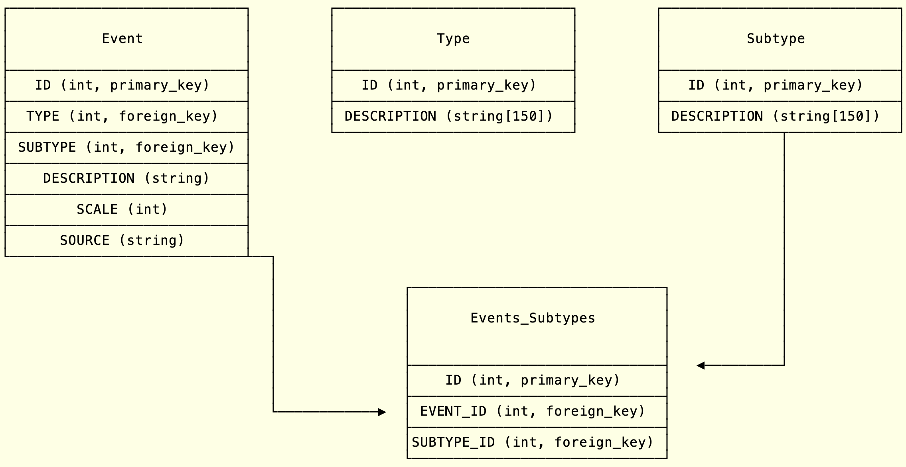

# Fascism Tracker API

> A collaborative account of every significant fascist event enacted by the current U.S. administration until it either ends or it ends us...

## Purpose

The purpose of this API is to provide a backend to pull data related to these fascists acts. It serves as an archive
and a way to search, sort, and filter these things so people can get an idea of the scale and speed of what is unfolding.

## Contributing

For simplicity and security, all contributions will happen via database
seeds. You write a database seed using standard SQL statements.

### Branches

The `master` branch is what ends up in production. It is all that will exist at first 
until the project is mature enough for a very basic deploy.

__`develop`__ is the branch where all pull requests will be merged into and tested

__`feature_`__ branches are branches you create and will submit when you want to create 
a pull request. 

To contribute to the code itself or even add an event through a seed, follow these steps:

1. Clone the project
2. Switch to the `develop` branch (`git checkout develop` or `git checkout -b develop && git pull origin develop`)
3. Create your own branch off of that and give it an appropriate name like `event_20250505` for events and `feat_<whatever_here>` for features
4. Push your branch to your repository and then open a pull request. Simple.

### What counts as a "fascist event"

We're tracking two main types of events: Fascism and events leading to World War III or similar wars.

## Deploy

This app has never been deployed but here are the notes for deploy written as 
I develop it so when it comes time to write a deploy script I remember:

1. Make sure Rust is installed on the server along with Cargo's `binstall` (no, that is not a type)
2. Install dependencies: `cargo build`
3. Run migrations with `diesel migration run` (testing the up/down migration at once to rebuild a database requires running `diesel migration redo`)
